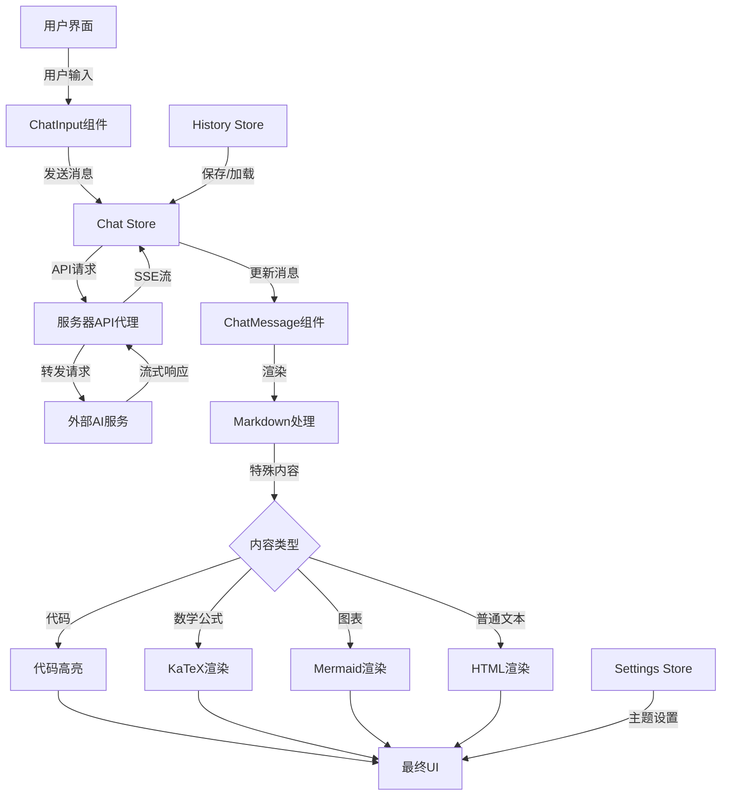

# AIchat 技术文档

## 1. 项目目录结构

```plaintext
AIchat/
├── api/                # API路由（用于Vercel部署的无服务器函数）
│   ├── chat.js         # 聊天API路由处理
│   └── verify-code.js  # 访问密码验证路由
├── dist/               # 构建输出目录
├── netlify/            # Netlify部署配置（备选部署方式）
│   └── functions/      # Netlify无服务器函数
│       ├── chat.js     # 聊天API函数
│       └── verify-code.js # 访问码验证函数
├── public/             # 静态资源文件
├── server/             # 服务器端代码（主要使用于Docker部署）
│   ├── api.js          # API路由和代理实现
│   └── index.js        # 服务器入口文件
├── src/                # 前端源代码
│   ├── assets/         # 资源文件(样式、图片、主题等)
│   │   ├── styles/     # SCSS样式文件
│   │   └── themes/     # 主题相关文件
│   ├── components/     # Vue组件
│   │   ├── ChatInput.vue    # 聊天输入组件
│   │   ├── ChatMessage.vue  # 消息显示组件
│   │   └── PasswordScreen.vue # 密码验证界面
│   ├── config/         # 配置文件
│   ├── router/         # Vue Router配置
│   ├── stores/         # Pinia状态管理
│   ├── utils/          # 工具函数
│   │   ├── apiService.js    # API服务（包含验证密码功能）
│   │   └── markdown.js      # Markdown处理
│   ├── views/          # 页面视图组件
│   ├── App.vue         # 根组件
│   └── main.js         # 应用入口文件
├── .dockerignore       # Docker忽略文件
├── .gitignore          # Git忽略文件
├── docker-compose.yml  # 开发环境Docker Compose配置
├── docker-compose.prod.yml # 生产环境Docker Compose配置（包含资源限制）
├── Dockerfile          # 标准Docker构建文件
├── Dockerfile.offline  # 离线部署Docker构建文件（不依赖外部CDN）
├── index.html          # HTML入口文件
├── netlify.toml        # Netlify配置文件
├── package.json        # 项目依赖配置
├── vite.config.js      # Vite构建配置
├── .env.example        # 环境变量示例文件
```

## 2. 逐文件分析

### 主要入口文件

**文件路径**：`src/main.js`  
**文件类型**：`JavaScript`  
**核心职责**：应用程序入口，初始化Vue应用和各种插件  
**依赖关系**：  
- 导入：Vue, Pinia, Vue Router, Element Plus, Mermaid等
- 导出：无直接导出
- 调用：创建Vue应用实例，注册插件，挂载到DOM  

**主要功能**：
```javascript
// 初始化Vue应用
const app = createApp(App)
const pinia = createPinia()
pinia.use(piniaPluginPersistedstate)

// 注册核心插件
app.use(pinia)
app.use(router)
app.use(ElementPlus)

// 注册所有Element Plus图标
for (const [key, component] of Object.entries(ElementPlusIconsVue)) {
  app.component(key, component)
}

// 挂载应用
app.mount('#app')

// 初始化Mermaid图表库并监听主题变化
```

**文件路径**：`src/App.vue`  
**文件类型**：`Vue`  
**核心职责**：应用根组件，包含整体布局和全局状态管理  
**依赖关系**：  
- 导入：Vue组件、Pinia存储、工具函数
- 导出：默认导出Vue组件
- 调用：子组件、状态管理函数  

### 服务器端

**文件路径**：`server/index.js`  
**文件类型**：`JavaScript`  
**核心职责**：Express服务器入口，处理API路由和静态文件服务  
**依赖关系**：  
- 导入：express, path, dotenv, api路由
- 导出：无直接导出
- 调用：Express应用配置和启动  

**主要函数**：
```javascript
// 创建Express应用
const app = express();
const PORT = process.env.PORT || 3000;

// API路由
app.use('/api', apiRoutes);

// 静态文件服务
app.use(express.static(path.join(__dirname, '../dist')));

// 所有其他请求返回index.html
app.get('*', (req, res) => {
  res.sendFile(path.join(__dirname, '../dist', 'index.html'));
});

// 启动服务器
app.listen(PORT, () => {
  console.log(`服务器运行在 http://localhost:${PORT}`);
});
```

**文件路径**：`server/api.js`  
**文件类型**：`JavaScript`  
**核心职责**：处理API请求，代理到AI服务提供商  
**依赖关系**：  
- 导入：express, cors, markdown-it等
- 导出：Express路由器
- 调用：外部API服务  

**主要函数/类**：
```javascript
// 处理聊天API请求
router.post('/chat', async (req, res) => {
  // 从环境变量获取API密钥
  const apiKey = process.env.API_KEY;
  
  // 处理流式响应
  if (stream) {
    // 设置响应头支持SSE
    res.setHeader('Content-Type', 'text/event-stream');
    
    // 调用外部API并转发流式响应
    const response = await fetch(apiUrl, {
      method: 'POST',
      headers: {
        'Content-Type': 'application/json',
        'Authorization': `Bearer ${apiKey}`
      },
      body: JSON.stringify({
        model,
        messages,
        temperature,
        max_tokens,
        stream: true
      })
    });
    
    // 处理流式数据转发
    const reader = response.body.getReader();
    const decoder = new TextDecoder();
    
    while (true) {
      const { done, value } = await reader.read();
      if (done) break;
      let chunk = decoder.decode(value, { stream: true });
      res.write(chunk);
    }
    
    res.end();
  } else {
    // 处理非流式响应
    // ...
  }
});
```

### 前端组件

**文件路径**：`src/views/ChatView.vue`  
**文件类型**：`Vue`  
**核心职责**：主聊天界面组件  
**依赖关系**：  
- 导入：ChatInput, ChatMessage等组件，Pinia存储
- 导出：默认导出Vue组件
- 调用：子组件、状态管理函数  

**文件路径**：`src/components/ChatMessage.vue`  
**文件类型**：`Vue`  
**核心职责**：渲染聊天消息，包括Markdown、代码高亮、数学公式和图表  
**依赖关系**：  
- 导入：markdown-it及其插件，highlight.js，KaTeX，Mermaid
- 导出：默认导出Vue组件
- 调用：Markdown渲染、代码高亮、数学公式渲染、图表生成  

**主要函数/类**：
```javascript
// Markdown渲染函数
function renderMarkdown(content) {
  // 创建markdown-it实例并配置插件
  const md = markdownIt({
    html: true,
    breaks: true,
    linkify: true,
    typographer: true,
    highlight: function(str, lang) {
      // 代码高亮处理
    }
  });
  
  // 注册插件
  md.use(markdownItTexmath, { engine: katex });
  md.use(markdownItHighlightjs);
  md.use(markdownItTaskLists);
  
  // 渲染Markdown内容
  return md.render(content);
}

// Mermaid图表处理
function processMermaidDiagrams() {
  // 查找并渲染所有Mermaid图表
  document.querySelectorAll('.mermaid').forEach(async (element) => {
    try {
      // 渲染Mermaid图表
      await mermaid.render(`mermaid-${Date.now()}`, element.textContent, (svgCode) => {
        element.innerHTML = svgCode;
      });
    } catch (error) {
      console.error('Mermaid渲染错误', error);
    }
  });
}
```

**文件路径**：`src/components/ChatInput.vue`  
**文件类型**：`Vue`  
**核心职责**：处理用户输入和发送消息  
**依赖关系**：  
- 导入：Element Plus组件，Pinia存储
- 导出：默认导出Vue组件
- 调用：发送消息API  

### 状态管理

**文件路径**：`src/stores/chat.js`  
**文件类型**：`JavaScript`  
**核心职责**：管理聊天状态和交互  
**依赖关系**：  
- 导入：Pinia
- 导出：useChatStore
- 调用：API服务  

**主要函数/类**：
```javascript
// 聊天状态存储
export const useChatStore = defineStore('chat', {
  state: () => ({
    messages: [],
    isLoading: false,
    currentStreamController: null
  }),
  
  actions: {
    // 发送消息
    async sendMessage(content) {
      // 添加用户消息
      this.messages.push({ role: 'user', content });
      this.isLoading = true;
      
      try {
        // 调用API获取响应
        const response = await fetchChatResponse(content);
        // 处理响应
        this.messages.push({ role: 'assistant', content: response });
      } catch (error) {
        console.error('发送消息失败', error);
      } finally {
        this.isLoading = false;
      }
    },
    
    // 取消当前流式响应
    cancelCurrentStream() {
      if (this.currentStreamController) {
        this.currentStreamController.abort();
        this.currentStreamController = null;
      }
    }
  }
});
```

**文件路径**：`src/stores/settings.js`  
**文件类型**：`JavaScript`  
**核心职责**：管理应用设置和配置  
**依赖关系**：  
- 导入：Pinia
- 导出：useSettingsStore
- 调用：无直接外部调用  

**文件路径**：`src/stores/history.js`  
**文件类型**：`JavaScript`  
**核心职责**：管理聊天历史记录  
**依赖关系**：  
- 导入：Pinia, uuid
- 导出：useHistoryStore
- 调用：无直接外部调用  

### 路由配置

**文件路径**：`src/router/index.js`  
**文件类型**：`JavaScript`  
**核心职责**：定义应用路由  
**依赖关系**：  
- 导入：Vue Router, 视图组件
- 导出：router实例
- 调用：Vue Router  

**主要函数/类**：
```javascript
// 创建路由器
const router = createRouter({
  history: createWebHistory(),
  routes: [
    {
      path: '/',
      name: 'chat',
      component: ChatView
    },
    {
      path: '/math-test',
      name: 'math-test',
      component: MathTest
    },
    {
      path: '/mermaid-test',
      name: 'mermaid-test',
      component: MermaidTest
    },
    {
      path: '/mermaid-error-test',
      name: 'mermaid-error-test',
      component: MermaidErrorTest
    }
  ]
})
```

## 3. 核心交互图



## 4. 技术说明

### 核心技术栈

- **前端框架**：Vue.js 3.5.x (组合式API)
- **状态管理**：Pinia + 持久化插件
- **路由**：Vue Router 4.x
- **UI组件库**：Element Plus
- **构建工具**：Vite 5.x
- **服务器**：Express.js
- **内容渲染**：
  - Markdown: markdown-it
  - 代码高亮: highlight.js
  - 数学公式: KaTeX
  - 图表: Mermaid
- **HTTP客户端**：Fetch API, Axios
- **容器化**：Docker, Docker Compose

### 架构设计模式

1. **前后端分离架构**：
   - 前端：Vue.js SPA应用
   - 后端：Express.js API服务器
   - 通过API代理与AI服务通信

2. **组件化设计**：
   - 使用Vue组件系统构建UI
   - 组件职责明确，高内聚低耦合

3. **状态管理模式**：
   - 使用Pinia进行集中状态管理
   - 持久化存储保存用户设置和聊天历史

4. **流式数据处理**：
   - 使用Server-Sent Events (SSE)实现流式响应
   - 支持长文本生成的实时显示

5. **适配器模式**：
   - 通过API适配层支持多种AI模型接口
   - 统一处理不同API提供商的请求和响应格式

### 关键设计决策

1. **使用Vue 3和组合式API**：
   - 提供更好的类型推断和代码组织
   - 支持更灵活的组件逻辑复用

2. **选择Pinia而非Vuex**：
   - 更简洁的API和更好的TypeScript支持
   - 模块化设计更符合应用需求

3. **服务器端代理**：
   - 保护API密钥不暴露给前端
   - 统一处理认证和错误

4. **使用markdown-it生态系统**：
   - 高度可扩展的Markdown渲染
   - 丰富的插件支持各种扩展语法

5. **Docker容器化部署**：
   - 简化部署和环境一致性
   - 支持多种部署场景

## 5. Docker部署与配置详解

### Docker部署架构

AIchat项目采用Docker容器化部署作为主要部署方式，主要通过以下文件实现：

1. **Dockerfile**: 定义主应用容器，包含前端构建和后端服务
2. **Dockerfile.offline**: 提供离线部署版本，不依赖外部CDN资源
3. **docker-compose.yml**: 开发环境的容器配置，包含基本设置
4. **docker-compose.prod.yml**: 生产环境的容器配置，增加了资源限制和优化

### Docker Compose配置对比

#### 开发环境 (docker-compose.yml)

```yaml
version: '3'

services:
  yourchat:
    build: .
    container_name: yourchat
    restart: unless-stopped
    ports:
      - "3000:3000"
    env_file:
      - .env
    environment:
      - NODE_ENV=production
```

#### 生产环境 (docker-compose.prod.yml)

```yaml
version: '3.8'

services:
  app:
    image: yourcaht-app
    container_name: yourcaht-app
    ports:
      - "3000:3000"
    restart: unless-stopped
    env_file:
      - .env
    environment:
      - NODE_ENV=production
    # 设置资源限制
    deploy:
      resources:
        limits:
          cpus: '1'
          memory: 1G
```

主要区别：
- 生产环境配置使用预构建镜像而非实时构建
- 生产环境添加了CPU和内存资源限制
- 生产环境使用更新的Docker Compose版本(3.8)

### 环境变量与配置文件

项目使用环境变量进行配置，主要通过以下方式管理：

1. **`.env`文件**: 包含基础配置，不应提交到版本控制
2. **环境变量注入**: Docker部署时通过环境变量注入敏感信息

关键环境变量：

```
# API配置
API_KEY=sk-your-api-key  # AI服务提供商的API密钥
API_URL=https://api.openai.com/v1/chat/completions  # API端点URL

# 服务器配置
PORT=3000  # 服务器监听端口
NODE_ENV=production  # 运行环境

# 安全配置
ACCESS_PASSWORD=your-access-password  # 可选的访问密码
```

### 部署步骤

1. **准备环境变量**:
   ```bash
   cp .env.example .env
   # 编辑.env文件，添加必要的配置
   ```

2. **开发环境部署**:
   ```bash
   docker-compose up -d
   ```

3. **生产环境部署**:
   ```bash
   # 构建镜像
   docker build -t yourcaht-app .
   
   # 启动容器
   docker-compose -f docker-compose.prod.yml up -d
   ```

4. **离线环境部署**:
   ```bash
   # 构建离线镜像
   docker build -f Dockerfile.offline -t yourcaht-app-offline .
   
   # 启动容器
   docker run -d -p 3000:3000 --env-file .env yourcaht-app-offline
   ```

## 6. 后端实现原理

### API代理机制

AIchat采用服务器端代理模式与AI服务提供商通信，主要出于以下考虑：

1. **安全性**: 保护API密钥不暴露给前端，避免被滥用
2. **统一接口**: 为前端提供一致的API接口，隐藏不同AI服务提供商的差异
3. **增强功能**: 在代理层添加额外功能，如流式响应处理、错误处理等

### 多平台部署支持

项目支持多种部署模式，每种模式都有对应的后端API实现：

1. **Docker部署**（完全支持）：
   - 使用`server/`目录中的Express服务器
   - 通过环境变量注入API密钥和配置
   - 支持流式响应和完整的API代理功能

2. **Vercel部署**（完整支持）：
   - 使用`api/`目录中的Vercel API路由
   - 支持无服务器函数模式部署
   - 使用Vercel环境变量存储API密钥
   - 支持流式响应和完整的API端点集

3. **Netlify部署**（完整支持）：
   - 使用`netlify/functions/`目录中的Netlify函数
   - 支持Netlify无服务器环境
   - 通过Netlify环境变量管理API密钥
   - 支持流式响应和完整的API端点集

### 部署方式比较

| 功能 | Docker | Vercel | Netlify |
|------|--------|--------|---------|
| 聊天API | ✅ 完整支持 | ✅ 完整支持 | ✅ 完整支持 |
| 流式响应 | ✅ 支持 | ✅ 支持 | ✅ 支持* |
| 密码验证 | ✅ 支持 | ✅ 支持 | ✅ 支持 |
| 健康检查 | ✅ 支持 | ✅ 支持 | ✅ 支持 |
| 模型列表 | ✅ 支持 | ✅ 支持 | ✅ 支持 |
| 提示词优化 | ✅ 支持 | ✅ 支持 | ✅ 支持 |
| 部署复杂度 | 中等 | 低 | 低 |
| 自定义域名 | ✅ 支持 | ✅ 支持 | ✅ 支持 |

\* Netlify使用优化的流式响应方案，在标准Functions中收集完整流后一次返回，或在Edge Functions中提供真正的流式响应。

### 密码验证机制

系统支持通过访问密码保护整个应用，实现方式如下：

1. **密码验证流程**：
   - 用户首次访问应用时，会检查是否需要密码验证
   - 如果需要，显示`PasswordScreen.vue`组件要求输入密码
   - 密码通过`apiService.js`中的`verifyAccessCode`函数发送到后端验证
   - 验证成功后，设置`settingsStore.isAuthenticated = true`允许访问应用

2. **后端验证实现**：
   - Docker部署：使用`server/api.js`中的路由处理验证请求
   - Vercel部署：使用`api/verify-code.js`处理验证请求
   - Netlify部署：使用`netlify/functions/verify-code.js`处理验证请求

3. **密码配置**：
   - 通过环境变量`WEBSITE_CODE`设置访问密码
   - 如果未设置或为空，则自动跳过验证

### 核心实现流程

1. **配置加载**:
   - 服务器启动时从环境变量加载API密钥和端点URL
   - 环境变量通过`.env`文件或Docker环境变量注入提供
   - 敏感信息不会暴露在前端代码中

2. **请求处理**:
   ```javascript
   // 从环境变量获取API密钥和URL
   const apiKey = process.env.API_KEY;
   const apiUrl = process.env.API_URL || 'https://api.openai.com/v1/chat/completions';
   
   // 转发请求到AI服务提供商
   const response = await fetch(apiUrl, {
     method: 'POST',
     headers: {
       'Content-Type': 'application/json',
       'Authorization': `Bearer ${apiKey}`
     },
     body: JSON.stringify(requestBody)
   });
   ```

3. **流式响应处理**:
   - 使用Server-Sent Events (SSE)实现流式响应
   - 服务器接收AI服务的流式数据并实时转发给前端
   - 前端通过EventSource接收流式数据并动态更新UI

4. **错误处理与重试**:
   - 服务器捕获并处理API错误
   - 实现请求重试机制处理临时网络问题
   - 向前端返回友好的错误信息

5. **访问控制**:
   - 可选的访问密码保护，通过`WEBSITE_CODE`环境变量配置
   - 验证通过后才允许访问应用功能
   - 支持在无密码模式下自动跳过验证

### 安全性设计

1. **API密钥保护**:
   - API密钥仅存储在服务器端环境变量中
   - 即使前端代码被检查也无法获取API密钥

2. **请求验证**:
   - 服务器验证前端请求的合法性
   - 可选的访问密码保护整个应用

3. **请求限制**:
   - 实现请求频率限制防止滥用
   - 可配置的最大令牌数限制资源消耗

### 前端与后端交互

虽然前端UI允许用户配置API密钥和端点，但这些配置有两种工作模式：

1. **直接模式**: 
   - 用户在前端输入的API密钥直接用于前端请求
   - 适用于开发环境或无需保护API密钥的场景
   - 在Vercel和Netlify部署中，如果后端API不可用，会自动切换到此模式

2. **代理模式** (推荐):
   - 前端请求发送到后端代理
   - 后端使用环境变量中的API密钥进行认证
   - 提供更好的安全性和功能扩展性

Docker部署默认使用代理模式，通过环境变量注入API密钥，确保密钥安全。

## 7. Vercel和Netlify部署完善建议

所有部署方式现在都提供完整功能支持，包括：

1. **流式响应**：
   - Vercel：使用标准Web Streams API实现
   - Netlify：使用两种方案，标准Functions收集流或Edge Functions真正流式响应

2. **API端点**：
   - 所有部署方式都支持完整的API端点集：
     - 聊天API (`/chat`)
     - 健康检查 (`/health`)
     - 模型列表 (`/models` 和 `/v1/models`)
     - 提示词优化 (`/optimize`)
     - 密码验证 (`/verify-code` 和 `/check-auth-required`)

3. **错误处理**：
   - 所有部署方式都实现了详细的错误日志和友好的错误消息

前端代码已经具备自动检测部署环境的能力，会根据当前URL自动选择正确的API路径：

```javascript
// src/utils/apiService.js 中的 getApiBaseUrl 函数
const getApiBaseUrl = () => {
  // 检测当前部署环境
  const hostname = window.location.hostname;
  
  // Netlify部署环境
  if (hostname.includes('netlify.app') || hostname.includes('netlify.com')) {
    console.log('检测到Netlify部署环境');
    return '/.netlify/functions';
  }
  
  // Vercel部署环境 (默认)
  // 包括vercel.app域名或自定义域名
  console.log('使用默认API路径 (Vercel或本地开发环境)');
  return '/api';
};
```

这确保了无论用户选择哪种部署方式，前端都能正确连接到对应的后端API。

## 8. 待办事项

- TODO: 添加用户认证系统
- TODO: 实现聊天历史的云同步
- TODO: 优化移动设备上的键盘体验
- TODO: 添加语音输入和输出支持
- TODO: 实现更多Markdown扩展功能
- FIXME: 修复Mermaid图表在暗模式下的渲染问题
- FIXME: 解决长时间聊天导致的性能下降
- TODO: 添加更多AI模型支持
- TODO: 添加国际化支持 